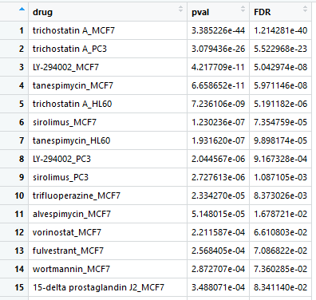
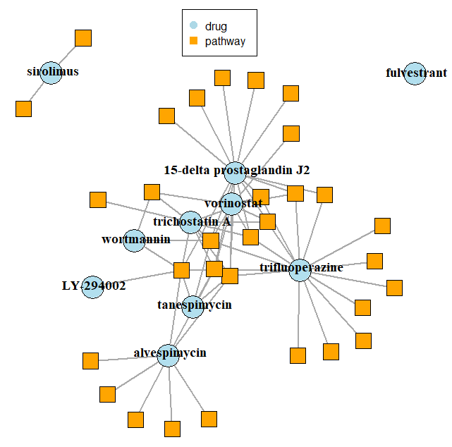
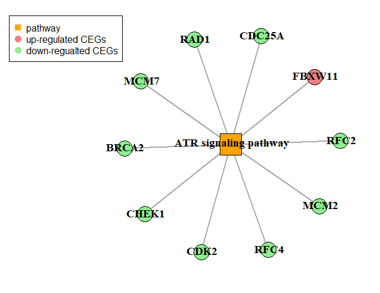

Dr. Insight provides a novel systematic connectivity mapping method to connect drugs (compounds) in CMap dataset with query data (disease phenotype or new drug profile). Dr. Insight package contains two components of drug repurposing analyses: (1) Drug identification analysis to identify the drugs that can reverse query disease phenotype (negative connectivity) or that might have similar functions with query drug data (positive connectivity); (2) Pathway analysis that reveals drug mechanism of action at pathway and gene level. 


## Drug Identification Analysis

In this package, we use CMap drug perturbation data as reference profiles for connectivity mapping. User can download the CMap data matrix from CMap website **https://portals.broadinstitute.org/cmap/ ** under "downloads" section, "data matrix" item. We provide the function `get.cmap.ref()` to load the CMap data matrix (in its original txt format) you downloaded into your local path into R, and process it into the format that can be used for the following drug identification function.

```{r,eval=F}
library("DrInsight")
# load in and process the downloaded CMap drug rank matrix
cmap.ref.profiles = get.cmap.ref(cmap.data.path = '/path_to/rankMatrix.txt')
```
This function needs the local path to the "rankMatrix.txt" file as input information, and produces the obejct **_cmap.ref.profiles_** that contains the CMap drug instance information and drug rank matrix. 

We then use the function `drug.ident()` to perform drug identification analysis. In addition to the **_cmap.ref.profiles_**, this function takes a user provided disease or drug data as query dataset (parameter `query.data`). The parameter `query.data`  takes a matrix containing two columns: geneSymbol and score. The scores in 'score' column can be any numeric scores from statistical test of differential analysis between query and control phenotype. (<span style="color:red">**Note**</span>: the column names of query.data matrix must be **'geneSymbol'** and **'score'**). Dr. Insight provides a demo query.data **_brca.tcga_**, which contains the tumor versus normal t-test statistic scores of TCGA breast cancer samples.

We perform drug identification with function `drug.ident()` and store the results in an object **_drug.ident.res_**:

```r
# load in the demo data: TCGA breast cancer data
data("brca.tcga")

# Dr. Insight drug identification
drug.ident.res = drug.ident(query.data = brca.tcga, cmap.ref.profiles = cmap.ref.profiles,
                 repurposing.unit = "treatment", connectivity = "negative")
```
The parameter `repurposing.unit` is to denote how the algorithm test drugs and calculate the connectivity p values. The options are `"treatment"` and `"drug"`. Here we use the default value "treatment" where the drug data collected from different cell lines are treated separately. The `CEG.threshold` parameter is a p value cutoff for selecting consistently differential expressed genes (CEGs), and we use 0.05 as a default value. The `connectivity` parameter is to denote the type of connectivity evaluation with `"negative"` or `"positive"` as choices. Negative connectivity is used when the query data is the differential scores from disease data, and positive connectivity is used when the query data is from a drug profile. Because the demo query data **_brca.tcga_** is a disease dataset so we use `"negative"`. 

When running the function `drug.ident()`, it should show following notes one by one:
```r
Data preprocessing ...

Identifying drug instance CEGs...

Calculating drug connectivity p values ...
```
The running time of this function is around 1 to 1.5 minutes.

The output object **_drug.ident.res_** contains three elements: a table of drug p values (and FDR) reflecting the connectivity between query data and CMap drugs **_drug.pvals_**; a table contains all the meta information of CMap drugs **_drug.info_**; and an object of gene level p values of CEGs for each drug instance **_CEG.pvals_**, which is mainly used for the following pathway analysis. We can then select out the drug p value table by:
```{r,eval=F}
# select the drug p value table
drug.pvals = drug.ident.res$drug.pvals
```
Now, the p values in the **_drug.pvals_** table gives the information of how likely the drugs in the CMap are potential treatment drug (or potential similar drugs if using positive connectivity analysis). A part of the **_drug.pvals_** table is shown below where the top 15 drug treatment groups (drug_cellLine) with FDR <= 0.1 are listed:  





## Pathway Analysis

Dr. Insight also provides pathway analysis where the mechanisms of identified drugs are investigated at pathway level. We perform the pathway analysis with function `pathway.analysis()`, which takes the output of drug identification **_drug.ident.res_** as input. The second input of this function is a list of pathways where each list contains the genes of a pathway and the list names are pathway names. Dr. Insight has the NCI pathway interaction database (PID) embeded, that can be loaded by data("pathway.PID"). If you want to use pathways from GSEA MsigDB, you can just download the pathway **gmt** file from http://software.broadinstitute.org/gsea/msigdb/collections.jsp, and provide the local path and pathway file name to the parameter `pathway.list.path`. One more parameter of this function is the FDR cutoff of drug identification results to denote which drugs will be analyzed for this mechanism study. In this tutorial, we use the default value 0.1.

```r
# load in pathway data (PID pathway as example)
data("pathway.PID")

# Perform pathway analysis (for the drugs that are identified by ident.drug())
path.analysis.res = pathway.analysis(drug.ident.res = drug.ident.res, pathway.list =pathway.PID, pathway.list.path = NULL, drug.FDR.cutoff = 0.1)
```
Or if you use the GSEA pathway gmt files stored at local path:
```r
# pathway analysis with local gmt pathway files
path.analysis.res = pathway.analysis(drug.ident.res = drug.ident.res, pathway.list = NULL, pathway.list.path = '/path_to/gmt.file', drug.FDR.cutoff = 0.1)
```
This function will show following notes to notify the process of analysis:
```r
Generating CEGs for identified significant drugs ...

Pathway significance tests ...
```

The running time of this function is dependent on the size of pathway list used. For the PID pathways, the running time is around 30s, but it could take longer time with larger pathways. 

Pathway analysis will return an object **_pathway.analysis.res_** consisting of four elements: a table **_drug.pathway.pvalues_** that contains the adjusted p value (FDR) of each pathway for each drug analyzed; a table **_pathway.pvalue.signs_** that is composed of '+' and '-' indicating up- and down-regulation of the pathway upon drug treatment; a list **_drug.CEGs_** that has the drug-level CEGs and their z scores for all the drugs analyzed; and also the list **_processed.pathway.list_** with the overlapping genes between each pathway and input data.

The pathway analysis result will be used as an input for the drug-pathway network and pathway-CEG network plotting. To show the drug-pathway network, the function `network.graph()` is used:

```r
#  construct drug-pathway interaction network
set.seed(2)
drug.pathway.network = network.graph(path.analysis.res = path.analysis.res, pathway.FDR.cutoff = 0.1, return.adj.table = TRUE)
```
This function will return the drug-pathway adjacency table with values '1', '0' '-1' where '1' means a drug up-regulates a pathway, '-1' means down-regulation and '0' means no significant regulation relationship, if the parameter `return.adj.table` is true. User can also choose if show pathway labels and the size of labels. The output figure of this function is like this:




The information of the drug-pathway-CEG relationship is stored in the **_pathway.analysis.res_** object from `pathway.analysis()` function as described. In addition, we also provide this function `path.CEG.network` to show with plot the CEGs in a specified pathway for a specified drug, and the regulation direction of the CEGs (The drug and pathway specified must be one of those listed in the **_drug.pathway.network_** table.). Below is an example where we show the CEGs of "tanespimycin"" on pathway "ATR signaling pathway":
```r
path.CEG.network = CEG.network.graph(path.analysis.res = path.analysis.res, pathway.FDR.cutoff = 0.1,drug.name = "tanespimycin", pathway.name = "ATR signaling pathway", show.plot = TRUE)
```





## Cytoscape Visualization

The layout of the network graphs in R can be unorganized sometimes. Because Cytoscape is a great software for network visualization, we can have the drug-pathway interaction relationship exported into files for Cytoscape visualization. The following command will produce the object that contain the two files for cytoscape input. 


```r
# get the pathway analysis output that can be loaded into Cytoscape for visualization
cytoscape.network = make.cytoscape.network(path.analysis.res = path.analysis.res, pathway.FDR.cutoff = 0.1)
```
The **_drug.pathway.network_** and **_node.attributes_** entries in the output object can be downloaded as two separate CSV files, which can be used as input for Cytoscape network visulization.

____________________________________________________________________________________________________

